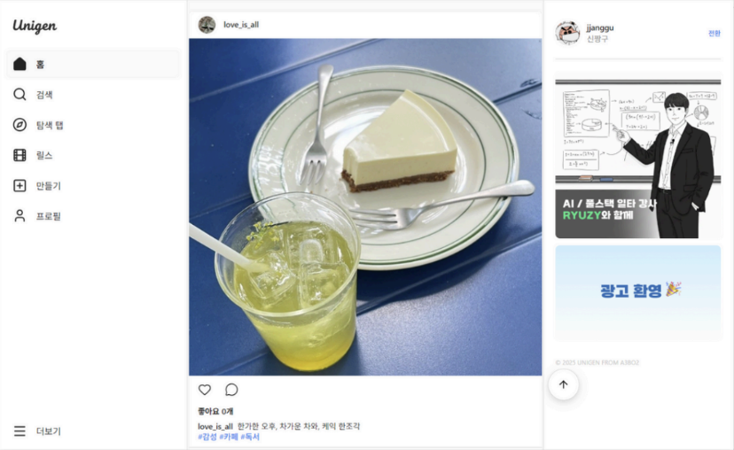

  <h1>UNIGEN - 세대를 연결하는 스마트 AI 소셜 플랫폼</h1>
  
🔍 시니어와 주니어를 잇는 AI 기반 이중 모드 SNS 🔍

 

  

 

  <a href="https://github.com/a3bo2/unigen-front">🖥️ Frontend Repo</a>
  &nbsp; | &nbsp;
  <a href="https://github.com/a3bo2/unigen-back">⚙️ Backend Repo</a>

---

## ✍️ 프로젝트 개요

- **프로젝트명:** UNIGEN (유니젠)
- **팀명:** A3BO2 (6인)
- **프로젝트 소개:** 디지털 소외 계층인 시니어를 배려한 UI/UX와 AI 기술을 결합하여, 전 세대가 함께 즐길 수 있는 스마트 소셜 플랫폼입니다.
- **핵심 가치:** 접근성(Accessibility), 편의성(Usability), 연결성(Connectivity)

---

## ✍️ 프로젝트 소개

### 프로젝트 배경

디지털 전환의 가속화로 일상이 모바일 중심으로 재편되었지만, 시니어 사용자들에게 기존 SNS는 여전히 높은 벽입니다.

1. **디지털 소외 현상:** 작은 글씨, 복잡한 메뉴 구조, 익숙하지 않은 입력 방식은 시니어의 정보 접근성을 저해합니다.
2. **소통의 단절:** 세대 간 사용하는 언어와 플랫폼이 분리되면서 디지털 환경에서의 세대 간 소통 기회가 줄어들고 있습니다.

**UNIGEN**은 이러한 문제를 해결하기 위해 **이중 모드 시스템**과 **AI 보조 기능**을 도입하여, 시니어도 부담 없이 참여할 수 있는 새로운 SNS 경험을 제안합니다.

---

### 문제점 해결 및 핵심 기능

- **이중 모드 시스템 (Dual Mode):** - **일반 모드:** 인스타그램 스타일의 트렌디한 SNS 경험 (피드, 릴스, 스토리).
    - **시니어 모드:** 큰 글씨, 단순화된 동선, 직관적인 UI로 사용성 극대화.
- **간편 인증 시스템:** 복잡한 ID/PW 대신 **Solapi 기반 SMS OTP** 인증을 도입하여 로그인 진입 장벽을 낮췄습니다.
- **AI 음성 입력:** **Web Speech API**를 활용해 타이핑 없이 말하듯이 게시글을 작성할 수 있습니다.
- **AI 게시글 도우미:** **OpenAI API(Vision)**를 통해 업로드한 이미지를 분석하고, 분위기에 맞는 문구와 해시태그를 자동 생성합니다.

---

## 🚀 프로젝트 목표

1. **디지털 격차 해소:** 시니어 친화적인 인터페이스 제공을 통해 전 연령층이 동등하게 정보를 향유하도록 함.
2. **세대 간 연결성 강화:** 동일한 서비스 내에서 서로 다른 모드를 사용하며 자연스럽게 소통할 수 있는 환경 구축.
3. **기술적 완성도 확보:** 실시간 영상 처리(릴스), AI 콘텐츠 생성, 안정적인 비동기 처리 시스템 구현.

---

## 📌 주요 기능

### **1. 지능형 게시글 작성 (AI & Voice)**
- **음성 인식:** 별도 설치 없이 브라우저 내장 기능을 통한 실시간 음성-텍스트 변환.
- **콘텐츠 생성:** 이미지 Base64 인코딩 분석 후 자연스러운 말투 변환 및 태그 추천.

### **2. 다양한 멀티미디어 콘텐츠**
- **릴스 & 스토리:** 짧은 비디오 기반의 릴스와 24시간 후 사라지는 스토리 기능 제공.
- **탐색 페이지:** 관심사 기반의 인기 게시물 및 새로운 사용자 추천.

### **3. 팔로우 및 인터랙션**
- **소셜 시스템:** 팔로우/팔로잉, 좋아요, 댓글 등 SNS 핵심 기능 완비.
- **보안 및 저장:** **JWT** 기반 인증과 **AWS S3**를 이용한 안정적인 이미지 관리.

---

## ⚙️ 기술 스택

<table>
  <thead>
    <tr>
      <th>분류</th>
      <th>기술 스택</th>
    </tr>
  </thead>
  <tbody>
    <tr>
      <td>프론트엔드</td>
      <td>
        
        
        
        
      </td>
    </tr>
    <tr>
      <td>백엔드</td>
      <td>
        
        
        
        
      </td>
    </tr>
    <tr>
      <td>AI / External API</td>
      <td>
        
        
        
      </td>
    </tr>
    <tr>
      <td>인프라 / 협업</td>
      <td>
        
        
        
        
      </td>
    </tr>
  </tbody>
</table>

---

## 📂 문서 자료

- [System Architecture](https://www.figma.com/board/9JqMt4F4xyDsLrNH6EHhMR/%EC%8B%9C%EC%8A%A4%ED%85%9C-%EC%95%84%ED%82%A4%ED%85%8D%EC%B3%90_Unigen?node-id=0-1&t=84D1VwJ89EiKG5wr-1)
- [JIRA](https://toegeunsikyeojwo.atlassian.net/jira/software/projects/A3BO2/boards/69/timeline?atlOrigin=eyJpIjoiMzViZDA5ZTQzNDZlNDkxZWFhMjY5ZDJkZmZhOWJjYzAiLCJwIjoiaiJ9)
- [발표 자료](https://drive.google.com/file/d/1vJfPSHYlQFAY60h0qjZ-27A647Uyoz2W/view?usp=sharing)

